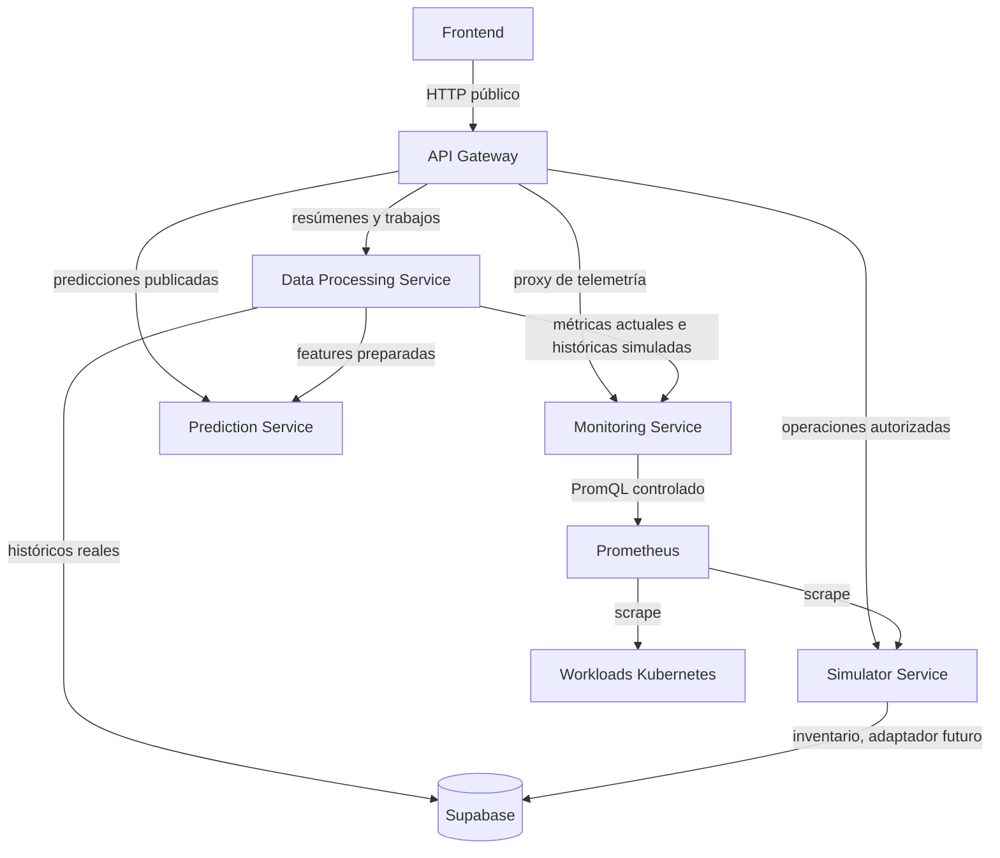

# Arquitectura del API Gateway e integración con Data Processing

Fecha: 2026-09-21  
Estado: propuesta de contrato para implementar el siguiente incremento.

## 1. Contexto confirmado

El flujo `Simulator → Prometheus → Monitoring` ya fue integrado localmente con Docker. Simulator expone métricas compatibles con Node Exporter, Prometheus las recolecta y Monitoring ofrece las consultas controladas:

- `GET /api/v1/metrics/catalog`
- `GET /api/v1/metrics/current`
- `GET /api/v1/metrics/history`

Monitoring devuelve JSON normalizado. No devuelve un DataFrame: Data Processing podrá construir uno internamente si usa pandas, pero ese detalle no debe formar parte del contrato entre servicios.

El Frontend solo se comunica con el Gateway. Las comunicaciones internas entre servicios no atraviesan el Gateway cuando no provienen del Frontend.

## 2. Arquitectura acordada



El sentido funcional de `Prometheus → Simulator` es scrape: Prometheus inicia la lectura del endpoint `/metrics`. Monitoring inicia consultas al API de Prometheus. Supabase puede ser una instancia física compartida, pero cada servicio posee credenciales y permisos mínimos para sus tablas.

## 3. Responsabilidades

### Gateway

- Único punto de entrada del Frontend.
- Autenticación y autorización cuando el incremento de seguridad sea habilitado.
- Enrutamiento, reescritura de prefijos, CORS, límites de tamaño, timeout y correlación de solicitudes.
- Conserva los códigos HTTP y cuerpos contractuales válidos de los servicios internos.
- No ejecuta PromQL, SQL, transformaciones analíticas ni accede a Supabase.
- No convierte métricas en textos de presentación ni agrega resultados de varios servicios en el primer incremento.

### Monitoring

- Traduce identificadores permitidos a PromQL controlado.
- Normaliza unidades, timestamps, calidad, procedencia e identidades.
- No prepara datasets de ML ni interpreta resultados para usuarios.

### Data Processing

- Consulta Monitoring por HTTP interno para series actuales o históricas.
- Lee históricos reales de Supabase con una identidad de servicio y permisos mínimos.
- Valida, limpia, alinea temporalmente, agrega y genera features o resúmenes.
- Distingue siempre `observed`, `simulated`, `estimated` y `unknown`.
- Entrega JSON versionado. DataFrame es una representación interna y nunca se transmite como contrato.
- Llama directamente a Prediction cuando el caso de uso sea un pipeline interno.

### Frontend

- Convierte unidades y valores en visualizaciones y lenguaje comprensible.
- Por ejemplo, presenta un ratio `0.64` como `64 %`, sin alterar el valor ni su procedencia.
- No conoce URLs internas, PromQL, SQL ni credenciales de Supabase.

## 4. Dos conexiones diferentes con Data Processing

### Flujo solicitado por el Frontend

```text
Frontend
  → GET /api/processing/v1/analytics/summary?... (Gateway)
  → GET /api/v1/analytics/summary?...            (Data Processing)
  → Monitoring y/o Supabase
  ← JSON procesado
  ← Gateway conserva estado, cuerpo y request ID
```

El Gateway resuelve el nombre interno de Data Processing mediante configuración. En Docker Compose sería `http://data-processing:8000`; en Kubernetes, un Service como `http://green-ai-data-processing:8000`. La dirección nunca debe estar codificada en el controlador.

### Pipeline interno o programado

```text
Data Processing
  → GET http://monitoring:8080/api/v1/metrics/history?...
  → consulta de solo lectura a Supabase
  → transformación y feature engineering
  → llamada interna a Prediction o persistencia acordada
```

Este flujo no pasa por Gateway. Hacerlo crearía una dependencia circular innecesaria y aplicaría reglas de tráfico externo a trabajos internos.

## 5. Rutas del Gateway

El Gateway publicará prefijos que identifican al servicio propietario. En el primer incremento debe actuar como proxy transparente y con lista explícita de rutas.

| Ruta externa | Destino interno | Reescritura |
| --- | --- | --- |
| `GET /api/monitoring/v1/metrics/catalog` | Monitoring | `/api/v1/metrics/catalog` |
| `GET /api/monitoring/v1/metrics/current` | Monitoring | `/api/v1/metrics/current` |
| `GET /api/monitoring/v1/metrics/history` | Monitoring | `/api/v1/metrics/history` |
| `GET /api/processing/v1/analytics/summary` | Data Processing | `/api/v1/analytics/summary` |
| `GET /api/processing/v1/analytics/history` | Data Processing | `/api/v1/analytics/history` |
| `POST /api/processing/v1/jobs` | Data Processing | `/api/v1/jobs` |
| `GET /api/processing/v1/jobs/{jobId}` | Data Processing | `/api/v1/jobs/{jobId}` |

Las tres rutas de Monitoring ya tienen contrato. Las cuatro rutas de Data Processing son un contrato propuesto: no se deben implementar en el Gateway hasta que el equipo propietario confirme nombres, parámetros, respuestas y semántica de trabajos.

No habilitar un comodín como `/api/** → red interna`. Cada ruta y método admitido debe estar registrado de forma explícita.

## 6. Contrato mínimo propuesto para Data Processing

### Resumen síncrono

```http
GET /api/v1/analytics/summary
    ?metric=node.cpu.utilization
    &start=2026-09-21T15:00:00Z
    &end=2026-09-21T16:00:00Z
    &cluster=sim-run-123
    &resourceId=node-01
```

Respuesta propuesta:

```json
{
  "metric": "node.cpu.utilization",
  "unit": "ratio",
  "period": {
    "start": "2026-09-21T15:00:00Z",
    "end": "2026-09-21T16:00:00Z"
  },
  "resource": {
    "type": "node",
    "cluster": "sim-run-123",
    "id": "node-01"
  },
  "statistics": {
    "sampleCount": 241,
    "validCount": 238,
    "minimum": 0.31,
    "maximum": 0.91,
    "mean": 0.64
  },
  "dataStatus": "partial",
  "origins": ["simulated"],
  "warnings": ["3 samples were missing"],
  "generatedAt": "2026-09-21T16:00:02Z"
}
```

Las estadísticas exactas y la política frente a muestras faltantes deben ser confirmadas por Data Processing. No calcular percentiles, rellenar huecos ni mezclar orígenes sin una regla versionada.

### Historia procesada

`GET /api/v1/analytics/history` devuelve una serie transformada o agregada. Debe declarar resolución, operación aplicada, unidad, procedencia y calidad. No debe reutilizar `dataStatus=complete` para afirmar que no hubo pérdidas si la entrada fue incompleta.

### Trabajos largos

`POST /api/v1/jobs` debe responder `202 Accepted`, un `jobId`, estado inicial y URL de consulta. `GET /api/v1/jobs/{jobId}` devuelve `queued`, `running`, `completed`, `failed` o `cancelled`. El Gateway no mantiene el estado del trabajo y no espera de forma síncrona a que termine un ETL.

## 7. Consumo exacto de Monitoring desde Data Processing

Data Processing utiliza el contrato interno, no el prefijo público del Gateway:

```http
GET http://monitoring:8080/api/v1/metrics/history
    ?metric=node.cpu.utilization
    &resourceType=node
    &cluster=sim-run-123
    &resourceId=node-01
    &start=2026-09-21T15:00:00Z
    &end=2026-09-21T16:00:00Z
    &stepSeconds=15
```

Reglas que debe respetar el cliente de Data Processing:

- `start` y `end` son RFC 3339 con zona; rango máximo de 24 horas.
- `stepSeconds` está entre 15 y 3600.
- Una petición consulta una métrica y puede devolver varias series.
- `series=[]` con `dataStatus=no_data` no es un error ni prueba que el recurso no exista.
- Una muestra `value=null` debe interpretarse según `quality=missing|non_finite`, nunca como cero.
- `origin` debe conservarse a través de todo el procesamiento.
- Los errores 400, 422, 502, 503 y 504 tienen semánticas distintas y no deben reemplazarse por un dataset vacío.
- Para intervalos mayores de 24 horas, Data Processing divide la consulta en ventanas contiguas, respeta extremos inclusivos y elimina únicamente la muestra duplicada de la frontera cuando identidad y timestamp coincidan.
- El cliente define timeout superior al presupuesto de Monitoring y limitado; no aplica reintentos automáticos a errores contractuales. Si se acuerdan reintentos transitorios, deben ser pocos, con backoff y trazabilidad.

## 8. Comportamiento transversal del Gateway

- Aceptar o generar `X-Request-Id`; propagarlo al upstream y devolverlo al cliente. Si Monitoring genera otro ID, registrar ambos sin sobrescribir evidencia.
- No exponer nombres DNS internos, trazas, PromQL, SQL ni credenciales en errores.
- Conservar `application/problem+json` de respuestas conocidas. Un timeout propio del Gateway debe usar un código de problema del Gateway, diferente del timeout comunicado por Monitoring.
- Configurar destinos mediante variables como `GATEWAY_MONITORING_BASE_URL` y `GATEWAY_DATA_PROCESSING_BASE_URL`.
- Aplicar timeout de conexión y total por ruta, tamaño máximo de petición/respuesta y límites de concurrencia. No reintentar métodos mutables por defecto.
- CORS con orígenes configurados explícitamente. No usar `*` junto con credenciales.
- Exponer liveness/readiness propios. Readiness del Gateway comprueba su configuración; no debe caer permanentemente solo porque un servicio downstream esté temporalmente indisponible.
- Métricas y logs del Gateway deben incluir ruta lógica, estado, duración y request ID, sin parámetros sensibles.

## 9. Orden de implementación recomendado

1. Elegir la tecnología del Gateway y fijar sus versiones. Los documentos generales proponen Python/FastAPI para servicios de ML, pero no fijan una tecnología para el Gateway; no asumir que la API de Prediction obliga al Gateway a usar Python.
2. Crear el repositorio independiente `green-ai-gateway`, sus instrucciones, configuración y health endpoints.
3. Implementar únicamente las tres rutas confirmadas de Monitoring con allowlist, reescritura, request ID, timeouts, límites y manejo de errores.
4. Publicar el OpenAPI externo del Gateway referenciando el contrato actual de Monitoring y documentando la reescritura.
5. Preparar configuración de Data Processing sin inventar que el servicio ya existe.
6. Acordar el OpenAPI de Data Processing: consultas síncronas, trabajos, política de datos faltantes, mezcla de orígenes, límites y errores.
7. Incorporar sus rutas explícitas al Gateway una vez aprobado el contrato.
8. Integrar en un entorno aislado: primero Gateway → Monitoring; después Gateway → Data Processing → Monitoring/Supabase.

## 10. Decisiones pendientes antes de implementar

- Tecnología del Gateway: proxy declarativo existente o servicio propio. Debe justificarse según autenticación futura, transformación requerida, operación y conocimientos del equipo.
- Alcance inicial de autenticación: sin seguridad en red local aislada o validación JWT desde el primer incremento.
- Contrato y propietario de las rutas de Data Processing.
- Si el Frontend consumirá métricas técnicas directamente desde Monitoring, resúmenes de Data Processing, o ambos.
- Política analítica ante datos faltantes y múltiples series de red/filesystem.
- Fuente autoritativa de históricos reales y DDL confirmado de Supabase.

Estas decisiones no impiden implementar el proxy controlado hacia Monitoring. Sí impiden afirmar que la integración Gateway–Data Processing está terminada.
